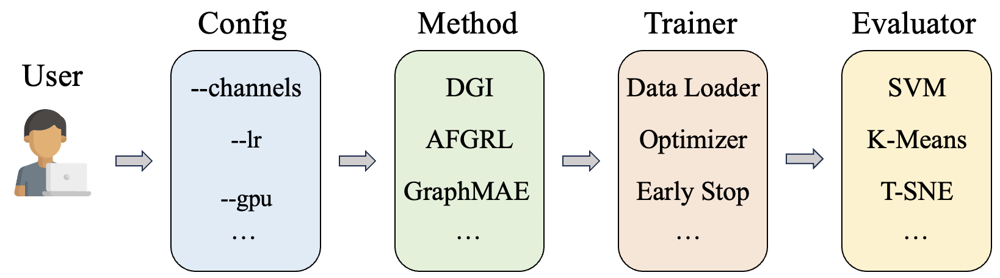

# pyg-ssl

**[Documentation](https://pygssl-tutorial.readthedocs.io/en/latest/index.html)** | **[Paper](https://arxiv.org/abs/2404.00225)**

PyG-SSL is a Python library built upon [PyTorch](https://pytorch.org) and [PyTorch Geometric](https://pytorch-geometric.readthedocs.io/en/latest/). It integrates state-of-the-art algorithms for Self-Supervised Learning on Graphs and offers simple APIs to call the algorithms from a variety of high-quality research papers.

**Node-level Algorithms for General Graphs**: [DGI](https://arxiv.org/pdf/1809.10341.pdf), [GraphCL](https://proceedings.nips.cc/paper/2020/file/3fe230348e9a12c13120749e3f9fa4cd-Paper.pdf), 
[MVGRL](https://proceedings.mlr.press/v119/hassani20a/hassani20a.pdf), [GCA](https://arxiv.org/abs/2010.14945), 
[SUGRL](https://ojs.aaai.org/index.php/AAAI/article/view/20748), [ReGCL](https://ojs.aaai.org/index.php/AAAI/article/view/28698), 
[BGRL](https://arxiv.org/abs/2102.06514), [AFGRL](https://arxiv.org/abs/2112.02472)

**Algorithms for Heterogeneous/Multiplex/Multiview Graphs**: [HeCo](https://arxiv.org/pdf/2105.09111.pdf)

**Graph-level Algorithms for Graph-level Representation Learning or Molecular Graphs**: [InfoGraph](https://openreview.net/pdf?id=r1lfF2NYvH), [GraphCL](https://proceedings.nips.cc/paper/2020/file/3fe230348e9a12c13120749e3f9fa4cd-Paper.pdf), [GraphMAE](https://arxiv.org/pdf/2205.10803.pdf)


----------------------------------------------------------

Generally, PyG-SSL have four components: Configuration, Method, Trainer and Evaluator. The user only needs to specify the configuration and write a simple script which calls the other components within this framework. The library will automatically run the method, train the model, and evaluate the results. The user can also customize the method, trainer, and evaluator to fit their own needs. We provide example configurations in the configuration folder , and example scripts in the root folder. The user can easily modify these configurations and scripts to run their own experiments.

## Installation
### Directly use the source
One way to use the source code is to clone the repository and install the dependencies. We recommend to create a new conda environment to prevent conflicts with other packages. 
```bash
conda create -n pyg-ssl python=3.9
pip install torch_geometric
pip install pyg_lib torch_scatter torch_sparse torch_cluster torch_spline_conv -f https://data.pyg.org/whl/torch-2.3.0+cu121.html
pip install faiss-gpu
pip install dgl -f https://data.dgl.ai/wheels/torch-2.3/cu121/repo.html
pip install scikit-learn matplotlib seaborn yacs
```
Then you are free to go with some basic examples.
```bash
python example_dgi.py
```

### Use our docker image


### Build from source


### Install from pip
We are preparing the pip package and will release it soon.


## Cite
If you find this repository useful in your research, please consider citing the following paper:

```
@inproceedings{DBLP:conf/kdd/ZhengJLTH24,
  author       = {Lecheng Zheng and
                  Baoyu Jing and
                  Zihao Li and
                  Hanghang Tong and
                  Jingrui He},
  editor       = {Ricardo Baeza{-}Yates and
                  Francesco Bonchi},
  title        = {Heterogeneous Contrastive Learning for Foundation Models and Beyond},
  booktitle    = {Proceedings of the 30th {ACM} {SIGKDD} Conference on Knowledge Discovery
                  and Data Mining, {KDD} 2024, Barcelona, Spain, August 25-29, 2024},
  pages        = {6666--6676},
  publisher    = {{ACM}},
  year         = {2024},
  url          = {https://doi.org/10.1145/3637528.3671454},
  doi          = {10.1145/3637528.3671454},
  timestamp    = {Sun, 08 Sep 2024 16:05:58 +0200},
  biburl       = {https://dblp.org/rec/conf/kdd/ZhengJLTH24.bib},
  bibsource    = {dblp computer science bibliography, https://dblp.org}
}
```